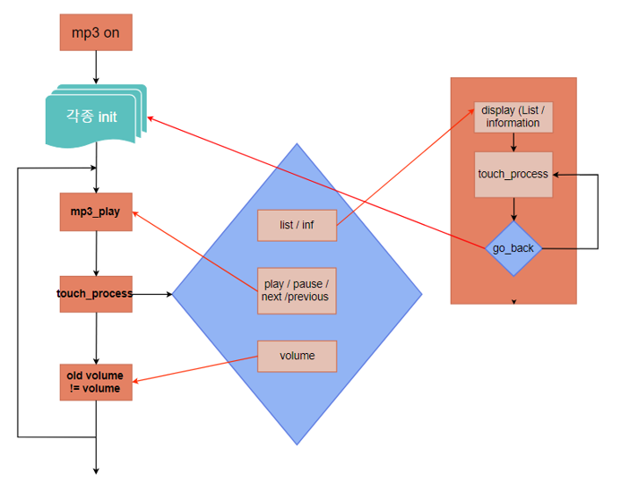

# :iphone: ARM Coretex m-3를 이용한 mp3 만들기

## 개발환경 : c / notepad++ / window

 

### 개발 목표

1. SD 메모리에 저장되어 있는 MP3 파일을 재생을 하고, 재생에 필요한 기능(Play/Pause/Next/Previous), 빠른 재생, 한 곡 반복, 전곡 반복, 무작위 재생 등의 기능들을 구현한다.

2. LCD에 재생되는 음악 리스트 표시, 음악의 선택기능. 곡의 시간 표시와 재생되는 곡명을 표시한다.

3. 재생 음량을 조절할 수 있도록 한다.

4. UI는 터치기능을 사용하여 구현한다.

5. 디지털 시계는 LCD에 표시되도록 한다.

 

### 구현 내용

1. 이전 곡, 다음곡, 재생, 일시정지
2. 빨리감기
3. 곡 정보보기
4. 음악 리스트 보기
5. interface ui 일부

 

### flow chart

 

### 구현하지 못한 기능

1. 음악 재생 기능 - 한 곡 반복, 전곡 반복, 무작위 재생
2. 음악 리스트에서 노래 선택 기능
3. 디지털 시계 표시
