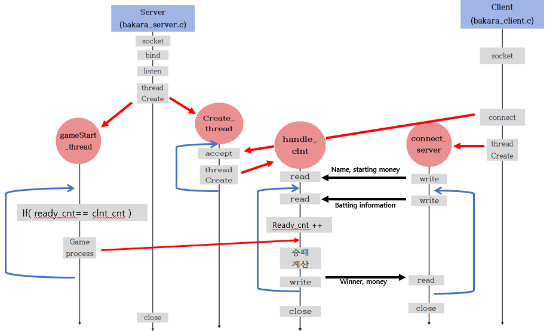

# 바카라 게임

## 네트워크 소켓, 멀티스레드 ,mutex 개념 실습을 통한 심화 학습

<br>

## 개발 환경 : C / VMWare (Ubuntu 20.04) / vscode

<br>

## 실행 방법

```
 1. Makefile을 이용해 make명령어로 server와 client 프로그램을 compile

 2.1 server는 Bserver <port 번호>로 실행
 2.2 client는 Bclient <server ip> <port 번호> <시작 name> <시작 money> 로 실행

 3. clinet가 배팅 후 모든 client 준비 완료되면 server가 자동으로 실행
```

<br>

### 구현한 기능

- 뱅커 / 플레이어 배팅
- 클라이언트는 시작 금액 설정
- 서버는 참가한 클라이언트가 모두 배팅해야 게임 시작
- 일정금액이하(돈을 다 잃으면) 강퇴 기능
- 서버는 수익을 알 수 있다.

<br>

### 공부한 내용

- tcp 소켓 통신의 흐름
- 다중 통신을 위한 방법 (멀티 프로세스, 멀티 스레드, 입력 다중화)

<br>

### flow chart



<br>

### 앞으로 추가 해볼 기능

- 클라이언트들 회원가입/로그인 구현 ( 나중에 토이프로젝트로 react로 구현 )
- 서버는 file로 저장 후 money도 불러오는 기능 구현
- 사이드 배팅인 tie/pair 구현
